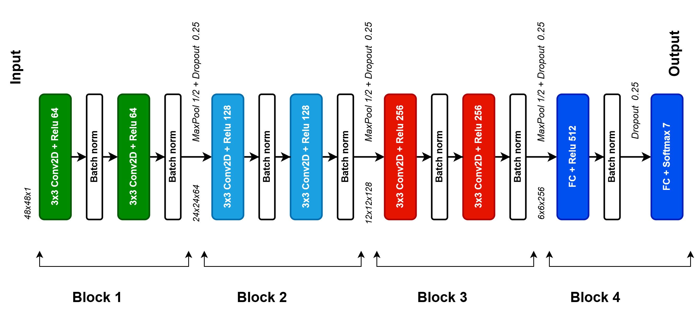
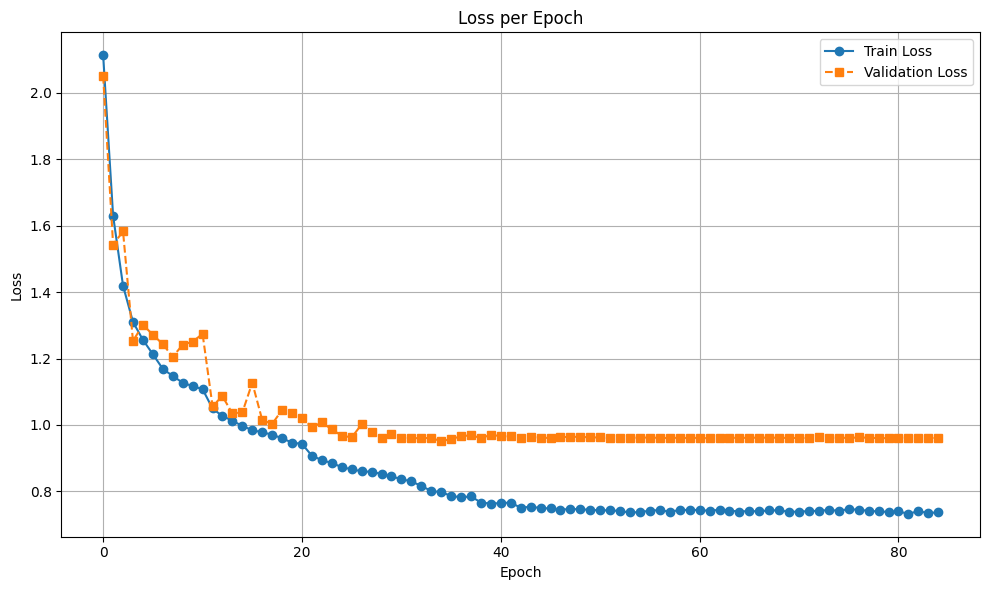
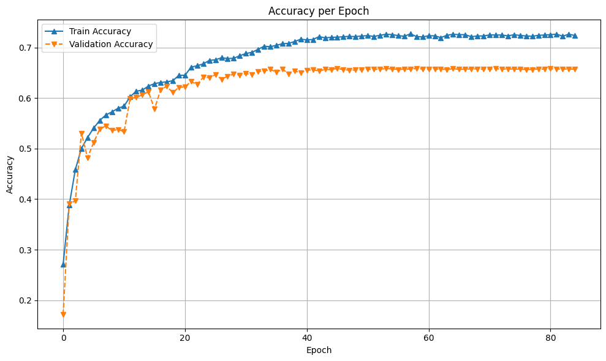
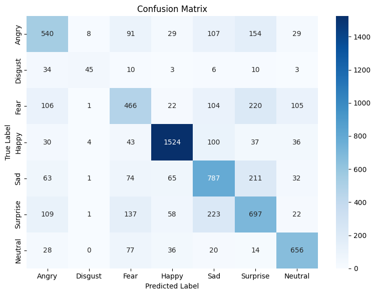

# Emotion Detection System

A real-time emotion recognition system that uses a deep learning model to detect seven emotions (Angry, Disgust, Fear, Happy, Sad, Surprise, Neutral).
## Setup

1. Clone the repository
2. Install conda environment and dependencies: 
```bash
    conda update conda
    conda env create -f environment.yml
```
4. Run the application: `python main.py`

## Model Information

The emotion detection uses a CNN model trained on the FER2013 dataset, recognizing 7 basic emotions:

- Angry
- Disgust
- Fear
- Happy
- Sad
- Surprise
- Neutral







## Update
- Version 1.0: Add facial model